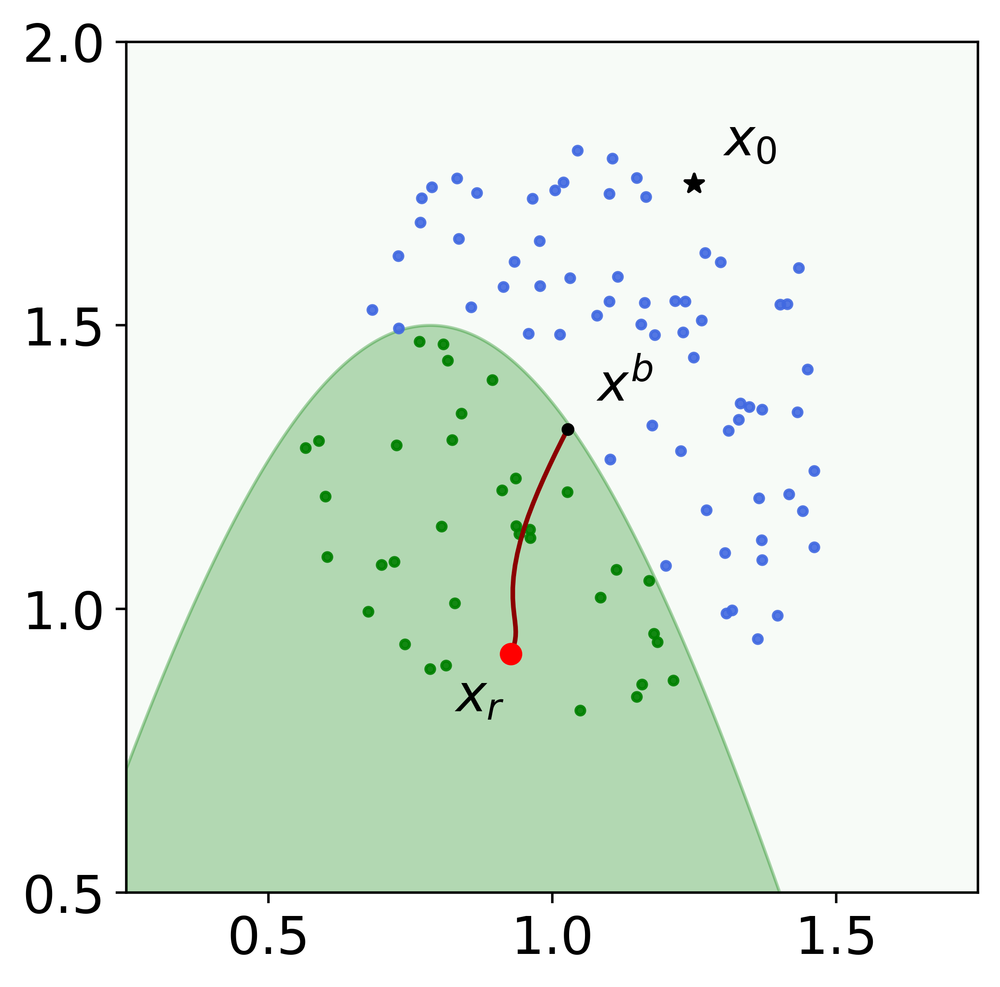

# Robust Bayesian Recourse

We introduce a model-agnostic recourse that minimizes the posterior probability odds ratio along its min-max robust counterpart with the goal of hedging against future changes in the machine learning model parameters. Robust Bayesian Recourse explicitly takes into account possible perturbations of the data in a Gaussian mixture ambiguity set prescribed using the optimal transport (Wasserstein) distance. 




*Details of the model architecture and experimental results can be found in [our paper](https://arxiv.org/abs/2206.10833)*

*Please CITE our paper whenever this repository is used to help produce published results or incorporated into other software:*
```
@InProceedings{nguyen2022robust,
    title = {Robust {B}ayesian recourse},
    booktitle = {Proceedings of the Thirty-Eighth Conference on Uncertainty in Artificial Intelligence},
    year =   {2022},
    series = {Proceedings of Machine Learning Research},
    publisher = {PMLR},
    author = {Nguyen, Tuan-Duy H. and Bui, Ngoc and Nguyen, Duy and Yue, Man-Chung and Nguyen, Viet Anh}
}
```

## Data
Our numerical experiments employ 1 synthetic and 3 real-world datasets. 

The synthetic dataset is automatically generated when you run the experiments. 

For real-world datasets, we recommend using [pandas](https://pandas.pydata.org/docs/) for preprocessing, following the steps described in [our paper](https://arxiv.org/abs/2206.10833).
- German Credit: 
    + [Original dataset](https://archive.ics.uci.edu/ml/datasets/statlog+(german+credit+data)) --> `./data/german_small.csv`
    + [Shifted dataset](https://archive.ics.uci.edu/ml/datasets/South+German+Credit) --> `./data/corrected_german_small.csv`
- Small Business Administration (SBA): [Source ('SBA Case' file in Supplementary Material section)](https://doi.org/10.1080/10691898.2018.1434342)
    + 1989 - 2005 --> `./data/sba_8905.csv`
    + 2006 - 2014 --> `./data/sba_0614.csv`
- Give Me Some Credit (GMC): [Source](https://www.kaggle.com/c/GiveMeSomeCredit/data)
    + `./data/gmc.csv`
    + `./data/gmc_shift.csv`

## Usage

1. Train a classifier

    ```sh
    python train.py --clf mlp --data synthesis german sba gmc --kfold 5 --num-future 100 --num-proc 16
    ```
    - **Args**:
        + `--clf`: List of types of classifiers to be trained
        + `--data`: List of datasets in use
        + `--kfold`: Number of subsamples for cross-validation
        + `--num-future`: Number of future (shifted) classifiers
        + `--num-proc`: Number of parallel processes

2. Run experiments

    ```sh
    python run_expt.py -e 5 --datasets synthesis german sba gmc -clf mlp -uc --methods wachter lime_roar limels_roar rbr --num-proc 32
    ```
    - **Args**:
        + `-e`: Selected experiment (for customization purpose, check `run_expt.py` for details)
        + `--datasets`: List of datasets in use
        + `--clf`: List of experimenting classifiers
        + `-uc`: Update configs for multiple trials
        + `--methods`: Number of experimenting methods
        + `--num-proc`: Number of parallel processes for each method